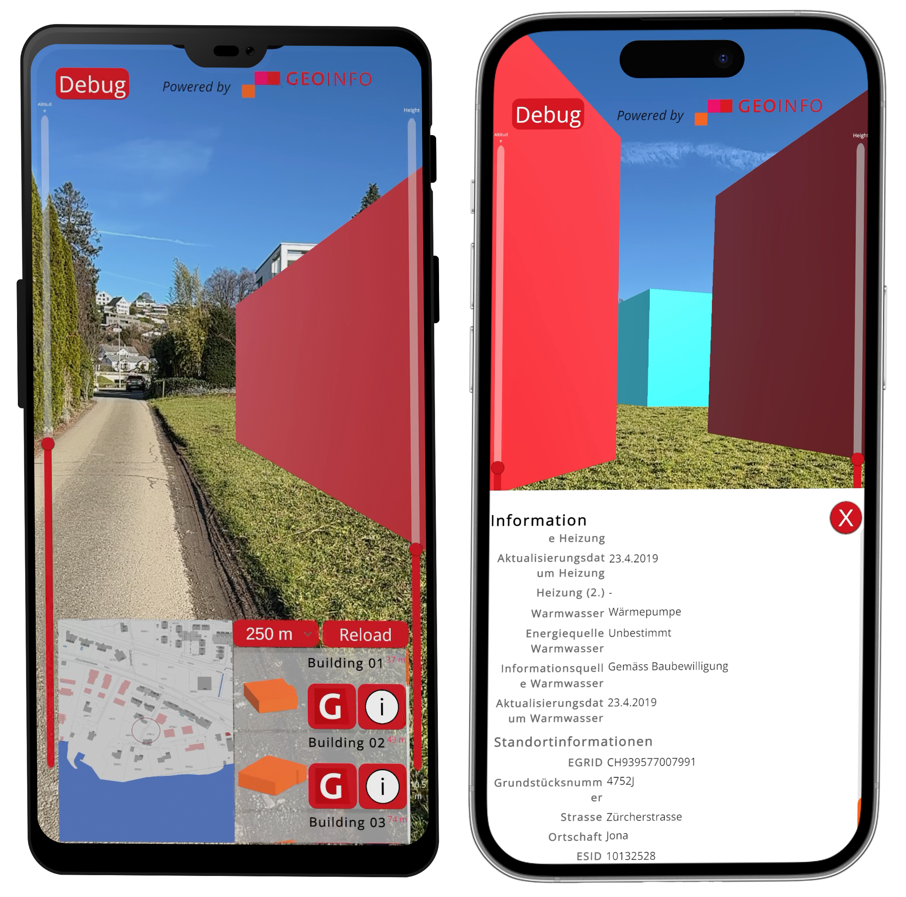
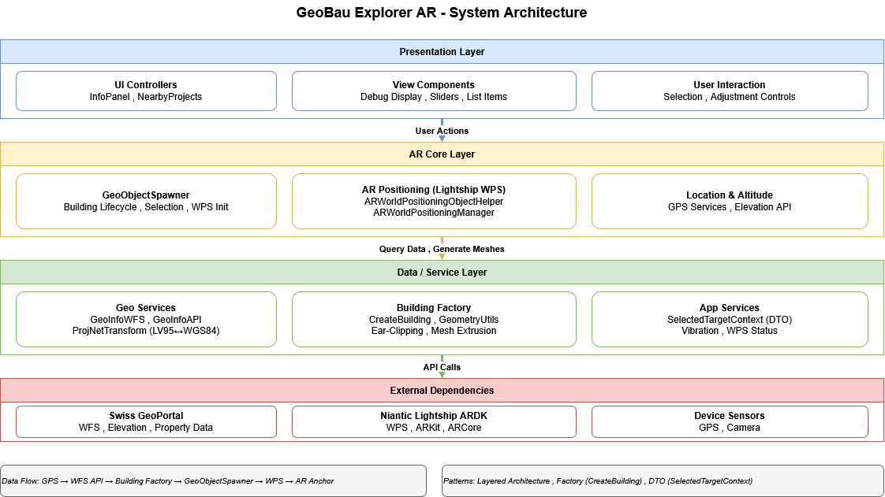
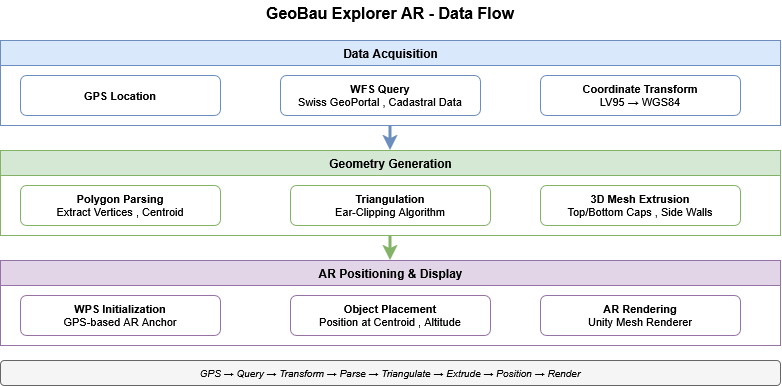
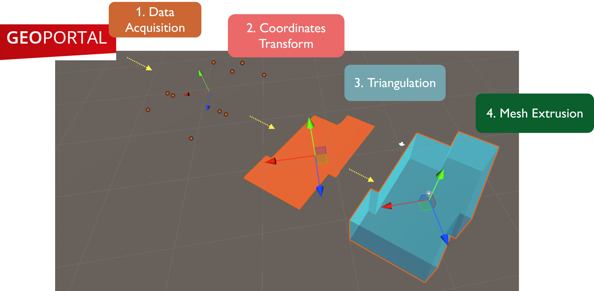

# GeoBau Explorer AR

**On-Site Visualization of Planned Construction Projects using Geospatial AR**

GeoBau Explorer AR is a mobile augmented reality application that overlays planned construction projects onto real-world locations using GPS-based positioning. The application targets Switzerland's construction sector, enabling users to visualize planned buildings at their actual geographic positions using Swiss cadastral data.

## Overview

This Unity-based AR application leverages:
- **Niantic Lightship SDK** for GPS-based World Positioning System (WPS)
- **Swiss GeoPortal APIs** for cadastral geometry and elevation data
- **Procedural mesh generation** for 3D building visualization
- **ARCore/ARKit** for mobile AR rendering

## System Architecture

The application follows a layered architecture with clear separation of concerns:

### Presentation Layer
- **UI Controllers**: `InfoPanelController`, `NearbyProjectsListController`
- **View Components**: Debug displays, adjustment sliders, list items
- **User Interaction**: Building selection and position adjustment controls

### AR Core Layer
- **GeoObjectSpawner**: Central orchestrator managing building lifecycle, selection, and WPS initialization
- **AR Positioning**: `ARWorldPositioningObjectHelper`, `ARWorldPositioningManager` for Lightship WPS integration
- **Location & Altitude**: GPS services and elevation API coordination

### Data/Service Layer
- **Geo Services**: `GeoInfoWFSAPI`, `GeoInfoAPI`, `ProjNetTransformCH` for coordinate transformation (LV95 ↔ WGS84)
- **Building Factory**: `CreateBuilding`, `BuildingGeometryUtils` implementing Ear-Clipping triangulation and mesh extrusion
- **App Services**: `SelectedTargetContext` (DTO pattern), vibration feedback, WPS status management

### External Dependencies
- **Swiss GeoPortal**: WFS for cadastral geometry, REST APIs for elevation and property data
- **Niantic Lightship ARDK**: WPS, ARKit, ARCore integration
- **Device Sensors**: GPS

## Data Flow

### 1. Data Acquisition
- **GPS Location**: User's current position (WGS84 coordinates)
- **WFS Query**: Fetch cadastral polygons from Swiss GeoPortal with "projektiert" status filter, 250m default radius (configurable)
- **Coordinate Transform**: Convert LV95 (EPSG:2056) to WGS84 (EPSG:4326) using ProjNet

### 2. Geometry Generation
- **Polygon Parsing**: Extract vertices from WFS response, calculate centroid in LV95
- **Triangulation**: Apply Ear-Clipping algorithm (O(n³) worst-case complexity) to decompose polygon into triangles
- **3D Mesh Extrusion**: Generate top/bottom caps and side walls to create volumetric building mesh

### 3. AR Positioning & Display
- **WPS Initialization**: Wait for Lightship WPS ready state (30s timeout), establish GPS-based AR anchor
- **Object Placement**: Position building at centroid coordinates with altitude offset (GeoPortal elevation API preferred, device GPS fallback)
- **AR Rendering**: Apply materials and render through Unity Mesh Renderer in camera view

## Key Features

### Building Reconstruction Pipeline
The application queries the Swiss GeoPortal WFS API for planned buildings within a 250-meter default radius (configurable) of the user's GPS position, filtering for "projektiert" status. Polygon coordinates in the LV95 Swiss coordinate system are parsed and transformed to WGS84. The Ear-Clipping algorithm triangulates each building footprint (O(n³) worst-case complexity), which is then extruded vertically to create a 3D mesh. Building altitude is determined by querying the GeoPortal elevation API with a 30ms delay between requests, falling back to device GPS if unavailable.

### AR Integration
The system initializes Niantic Lightship's World Positioning System (WPS) with a 30-second timeout before spawning buildings to prevent position "jumps" during localization. WPS uses GPS and device sensors (no visual localization) to anchor buildings at their real-world coordinates. Each building's centroid is converted from LV95 to WGS84, and altitude is applied from the GeoPortal elevation API when available, otherwise defaulting to device GPS altitude. Building meshes are rendered with Unity's standard material system and positioned through the `ARWorldPositioningObjectHelper`.

### Coordinate Transformation
The `ProjNetTransformCH` utility handles coordinate system conversions between Swiss LV95 (EPSG:2056) and WGS84 (EPSG:4326) using official EPSG WKT definitions from the ProjNet library.

### User Interaction
- **Building Selection**: Tap to select buildings and view detailed information (EGID, owner, geometry)
- **Manual Adjustment**: Sliders to adjust building height (extrusion) and altitude (vertical position)
- **Info Panel**: Displays building metadata from cadastral database including name, EGID, coordinates, and land registry data
- **Debug Display**: Real-time GPS accuracy, WPS status, and coordinate information HUD

## Implementation Details

### Critical Components

**GeoObjectSpawner.cs**
- Manages building lifecycle: spawning, selection, adjustment
- Defers building spawn until WPS is ready to prevent positioning errors
- Coordinates altitude sources (API elevation > device GPS)
- Implements selection highlighting with color property blocks

**CreateBuilding.cs**
- Factory pattern for procedural mesh generation
- Implements Ear-Clipping triangulation in `TriangulatePolygon()`
- `BuildThickMesh()` creates extruded 3D geometry from 2D footprint
- Converts LV95 centroid to WGS84 for AR positioning

**GeoInfoWFSAPI.cs**
- Constructs WFS queries with BBOX parameter and "projektiert" status filter
- Sequential elevation enrichment with 30ms delay to avoid API rate limits
- Parses GML responses and extracts building polygons

**ARWorldPositioningObjectHelper** (Lightship SDK)
- Lightship SDK component for positioning objects at GPS coordinates
- Handles WPS anchor creation and coordinate conversion
- Manages object transforms based on WPS tracking state

### Design Patterns
- **Layered Architecture**: Clear separation between presentation, AR core, data/service, and external layers
- **Factory Pattern**: `CreateBuilding` encapsulates complex mesh generation logic
- **DTO Pattern**: `SelectedTargetContext` transfers building data between layers
- **Observer Pattern**: Event-driven updates for selection and WPS status changes

## Testing & Validation

### Component Testing
- Coordinate transformation verified against official Swiss swisstopo examples
- Mesh generation tested with various polygon complexities (convex, concave, multi-vertex)
- Ear-Clipping algorithm validated for correctness and edge cases

### Field Testing
Conducted at HSG campus with following results:

| Metric | Result |
|--------|--------|
| WPS Accuracy | ±5-15m (GPS-dependent) |
| Building Count | 10-50 per query (250m default radius) |
| Mesh Generation | <100ms per building |
| Elevation API | 30ms delay per request |

### Limitations
- **GPS Positioning**: WPS accuracy varies with GPS signal quality (typically ±5-15m)
- **No Visual Localization**: Pure GPS-based positioning, no VPS or image-based refinement
- **Algorithmic Complexity**: Ear-Clipping O(n³) becomes noticeable with >100 vertices
- **API Rate Limits**: Sequential elevation queries add latency for many buildings

## Technical Constraints

### Performance
- Ear-Clipping triangulation: O(n³) worst-case, impacts buildings with complex footprints
- WPS initialization: Up to 30 seconds until positioning becomes stable
- Elevation API: 30ms delay between requests to respect Swiss GeoPortal rate limits

### Platform Requirements
- **iOS**: ARKit-compatible device (iPhone 6S or newer)
- **Android**: ARCore-supported device with GPS
- **Network**: Active internet connection for WFS/elevation API queries

### Data Availability
- Limited to areas covered by Swiss cadastral database
- Only displays buildings with "projektiert" (planned) status
- Requires accurate GPS signal for positioning

## Trade-offs & Design Decisions

1. **GPS vs. VPS**: Chose GPS-based WPS for Switzerland-wide coverage, accepting lower accuracy than image-based VPS
2. **Sequential Elevation Queries**: Prioritized API compliance over speed with 30ms delays
3. **Deferred Spawn**: Wait for WPS ready state to avoid position jumps, improving user experience at cost of initial delay
4. **Manual Adjustment UI**: Provide sliders for height/altitude adjustment to compensate for GPS positioning variability

## Development Setup

### Requirements
- Unity 6000.0.62f1 or newer
- Niantic Lightship ARDK

### Configuration
1. Clone repository
2. Open project in Unity
3. Configure Lightship API key in project settings
4. Build for iOS or Android target platform

## Future Work

Potential improvements include:
- Progressive loading and Level of Detail systems for improved scalability in dense urban areas
- Placement correction algorithms that refine positioning using visual feature detection or user-assisted alignment
- Enhance altitude accuracys through better terrain data integration or calibration mechanisms
- Compass-based navigation to guide users toward nearby projects
- API abstraction layer to insulate the application from upstream GeoPortal service changes and facilitate potential migration to alternative data sources

## Acknowledgements

This project was developed as part of the HSG HS25 IMP course. Special thanks to:
- GeoInfo (geoportal.ch) for cadastral and elevation data APIs
- Niantic for the Lightship ARDK platform
- ProjNet contributors for coordinate transformation library

## License

This project is intended for academic and research purposes.

---

**Built with Unity • Niantic Lightship • Swiss GeoPortal APIs**
